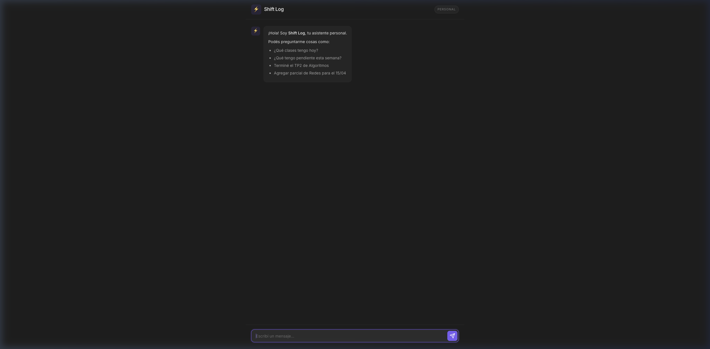

<div align="center">

# ⚡ Shift Log

**A conversational personal task & time manager.**

Minimal. Fast. Zero friction.



---

[](https://python.org)
[](https://fastapi.tiangolo.com)
[](https://sqlite.org)
[](https://ollama.com)
[](LICENSE)

[Documentación en Español](docs/README.md)

</div>

---

## About

Shift Log is a **single-user, conversational task manager** built for managing academic schedules, assignments, exams, and reminders through a simple chat interface. Instead of calendars, Kanban boards, or complex UIs, you just type what you need in natural language.

**Ask:**
> "What classes do I have today?"

**Tell:**
> "I finished TP2 for Algorithms"

**Query:**
> "What's pending this week?"

The system interprets your intent using a **local LLM** (via Ollama), executes the corresponding database query, and responds instantly.

---

## Features

- 🗣️ **Natural language interface** — No rigid commands, just talk
- 🌙 **Dark mode UI** — Obsidian/Notion-inspired design
- 🧠 **Local LLM** — Powered by Ollama, 100% private, no API costs
- 📅 **Schedule management** — Fixed class schedules per semester
- ✅ **Task lifecycle** — States: `pending` → `in progress` → `completed` / `overdue`
- 🗓️ **Weekly Schedule Modal** — Quick access to a full, paginated table of your classes (IES 6023, UNSa, etc.)
- ⏰ **Automatic overdue detection** — Tasks past their deadline are flagged
- 📱 **Mobile-ready** — Responsive design, accessible via local network
- 🪶 **Lightweight** — Vanilla HTML/CSS/JS frontend, SQLite database

---

## Tech Stack

| Layer | Technology | Why |
|-------|-----------|-----|
| Database | **SQLite** | Native date queries, zero setup, single file |
| Backend | **FastAPI** | Async-ready for LLM calls, auto-validation |
| LLM | **Ollama** | Local, private, free, fast with small models |
| Frontend | **Vanilla HTML/CSS/JS** | One screen, zero build step, full control |

---

## Quick Start

### Prerequisites

- Python 3.10+
- [Ollama](https://ollama.com) installed and running

### Installation

```bash
# Clone the repository
git clone https://github.com/jdfesa/shift-log.git
cd shift-log

# Create virtual environment and install dependencies
python3 -m venv venv
source venv/bin/activate
pip install -r backend/requirements.txt

# Pull an LLM model
ollama pull phi3:mini
```

### Run

```bash
# Start Ollama (if not already running)
ollama serve

# Start Shift Log
source venv/bin/activate
cd backend && python main.py
```

Open **http://127.0.0.1:8000** in your browser.

---

## Project Structure

```
shift-log/
├── backend/
│   ├── main.py                # FastAPI entry point
│   ├── config.py              # Server, DB & Ollama config
│   ├── database.py            # SQLite connection & schema
│   ├── models.py              # Pydantic models
│   ├── routes/
│   │   ├── chat.py            # POST /api/chat
│   │   └── tasks.py           # REST CRUD endpoints
│   └── services/
│       ├── ollama_service.py   # LLM communication
│       ├── intent_parser.py    # Intent → DB action → response
│       └── task_service.py     # Business logic & queries
├── frontend/
│   ├── index.html
│   ├── style.css              # Dark mode design
│   └── app.js                 # Chat UI logic
├── data/
│   └── shift_log.db           # Auto-created on first run
└── docs/                      # Full documentation (Spanish)
```

---

## API Endpoints

| Method | Endpoint | Description |
|--------|----------|-------------|
| `POST` | `/api/chat` | Main chat endpoint (natural language) |
| `GET` | `/api/materias` | List all subjects |
| `POST` | `/api/materias` | Add a subject |
| `GET` | `/api/horarios` | List schedules |
| `POST` | `/api/horarios` | Add a schedule |
| `GET` | `/api/tareas` | List tasks (filterable) |
| `POST` | `/api/tareas` | Add a task |
| `DELETE` | `/api/tareas/{id}` | Delete a task |

Full API docs available at `/docs` (Swagger UI) when the server is running.

---

## Documentation

Complete documentation in Spanish is available in the [`docs/`](docs/README.md) directory:

- [Arquitectura y Stack Tecnológico](docs/arquitectura.md)
- [Esquema de Base de Datos](docs/base_de_datos.md)
- [Referencia de API](docs/api_reference.md)
- [Guía de Instalación y Uso](docs/instalacion_y_uso.md)
- [Lógica Conversacional](docs/logica_conversacional.md)

---

## License

This project is for personal use. MIT License.
